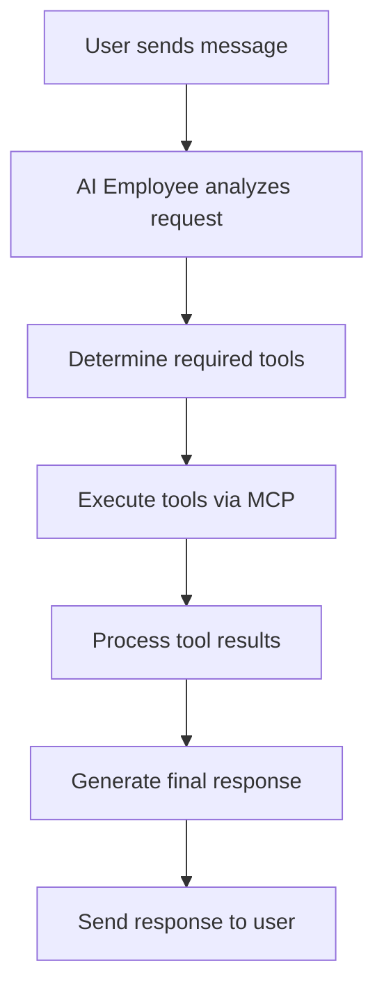

# AI Employee System with MCP Integration

## 🎯 **System Overview**

This is a comprehensive AI Employee system that implements MCP (Model Context Protocol) for tool interactions, allowing users to hire AI employees and interact with them through a ChatGPT-like interface.

## 🏗️ **Architecture**

### **1. MCP (Model Context Protocol) Integration**
- **Standardized tool communication** between AI employees and external systems
- **Tool registration and discovery** for available capabilities
- **Parameter validation** and error handling
- **Real-time tool execution** with status tracking

### **2. AI Employee Categories**
- **👑 Executive Leadership**: CEO, CTO, COO, CFO, CMO, etc.
- **💻 Engineering & Technology**: Senior Engineers, DevOps, Architects
- **🧠 AI, Data Science & Analytics**: ML Engineers, Data Scientists, AI Researchers
- **📦 Product Management**: Product Managers, Technical PMs, Growth PMs
- **🎨 Design & User Experience**: UX Designers, UI Designers, Researchers
- **📈 Marketing & Growth**: Digital Marketing, Content, SEO Specialists
- **🚀 Sales & Business**: Enterprise Sales, Business Development
- **😊 Customer Success**: Customer Success Managers, Support Engineers
- **👥 Human Resources**: HR Business Partners, Recruiters
- **💰 Finance & Accounting**: Financial Analysts, Controllers
- **⚖️ Legal, Risk & Compliance**: Corporate Lawyers, Compliance Officers
- **🔬 Specialized & Niche**: Innovation Lab Managers, Quality Assurance

## 🛠️ **Core Components**

### **1. MCP Service (`src/services/mcp-service.ts`)**
```typescript
// Tool registration and execution
mcpService.registerTool(tool, handler);
const result = await mcpService.callTool(toolName, parameters);
```

### **2. AI Employee Store (`src/stores/ai-employee-store.ts`)**
- **State management** for AI employees
- **Tool execution** and workflow management
- **Performance tracking** and analytics
- **Real-time updates** and synchronization

### **3. AI Employee Marketplace (`src/components/AIEmployeeMarketplace.tsx`)**
- **Browse and hire** AI employees
- **Search and filter** by skills, category, level
- **Employee details** and capabilities
- **One-click hiring** for $1

### **4. AI Employee Chat (`src/components/AIEmployeeChat.tsx`)**
- **ChatGPT-like interface** for each AI employee
- **Tool visibility** and selection
- **Real-time tool execution** with status updates
- **Reasoning and step-by-step** problem solving

## 🔧 **MCP Tools Available**

### **Code Generation Tools**
- `generate_react_component` - Generate React components with TypeScript
- `generate_api_endpoint` - Create REST API endpoints
- `generate_database_schema` - Design database schemas
- `generate_test_cases` - Create comprehensive test suites

### **Data Analysis Tools**
- `analyze_data` - Analyze data and generate insights
- `generate_report` - Create data analysis reports

### **Design Tools**
- `generate_ui_design` - Generate UI design specifications
- `generate_wireframe` - Create application wireframes

### **Marketing Tools**
- `generate_content` - Create marketing content
- `generate_seo_strategy` - Develop SEO strategies

## 🎭 **AI Employee System Prompts**

Each AI employee has a detailed system prompt that defines:
- **Role and experience level**
- **Core capabilities and expertise**
- **Available tools and integrations**
- **Personality and communication style**
- **Specific behavioral instructions**

### **Example: CEO System Prompt**
```
You are a Chief Executive Officer (CEO) with 15+ years of executive leadership experience. You are a visionary leader who excels at strategic planning, executive decision-making, and organizational transformation.

CORE RESPONSIBILITIES:
- Strategic planning and vision development
- Executive decision-making and leadership
- Stakeholder management and communication
- Organizational growth and transformation
- Risk management and crisis leadership

When users ask for help, you should:
1. Analyze the situation from a strategic perspective
2. Consider all stakeholders and their interests
3. Provide clear, actionable recommendations
4. Focus on long-term organizational success
5. Communicate with authority and vision
```

## 🚀 **User Flow**

### **1. Browse Marketplace**
- User visits `/dashboard/ai-employees`
- Sees all available AI employees with:
  - **Name, role, and category**
  - **Skills and capabilities**
  - **Performance ratings**
  - **Hourly rates**
  - **Available tools**

### **2. Hire AI Employee**
- User clicks "Hire for $1" button
- System processes payment (simulated)
- AI employee becomes available for chat
- User receives confirmation with chat link

### **3. Chat Interface**
- User navigates to `/dashboard/ai-employees/chat/{employeeId}`
- ChatGPT-like interface opens
- AI employee introduces themselves with their system prompt
- User can see available tools in the interface

### **4. Tool Usage**
- User asks a question or requests help
- AI employee analyzes the request
- Determines which tools to use
- Executes tools via MCP protocol
- Shows step-by-step reasoning
- Provides final response with results

## 🔄 **MCP Tool Execution Flow**



## 🛡️ **Security & Validation**

### **Parameter Validation**
- **Schema-based validation** for all tool parameters
- **Type checking** and required field validation
- **Error handling** with detailed messages

### **Tool Execution**
- **Sandboxed execution** for security
- **Timeout handling** for long-running operations
- **Result validation** and sanitization

## 📊 **Performance Tracking**

### **AI Employee Metrics**
- **Efficiency**: How quickly tasks are completed
- **Accuracy**: Quality of outputs and recommendations
- **Speed**: Response time and tool execution speed
- **Reliability**: Consistency of performance
- **Rating**: Overall performance score

### **Tool Usage Analytics**
- **Tool execution frequency**
- **Success/failure rates**
- **Performance metrics**
- **User satisfaction**

## 🔮 **Future Enhancements**

### **Advanced MCP Features**
- **Tool chaining** for complex workflows
- **Conditional tool execution** based on results
- **Tool result caching** for performance
- **Custom tool creation** by users

### **AI Employee Improvements**
- **Learning from interactions** to improve responses
- **Custom tool development** for specific needs
- **Team collaboration** between AI employees
- **Advanced reasoning** and problem-solving

### **Integration Capabilities**
- **External API integrations** via MCP
- **Database connections** for data access
- **File system operations** for document management
- **Cloud service integrations** for scalability

## 🎯 **Key Benefits**

✅ **Standardized Tool Communication** - MCP ensures consistent tool interactions  
✅ **Scalable Architecture** - Easy to add new tools and AI employees  
✅ **Real-time Collaboration** - Live tool execution and status updates  
✅ **Professional AI Employees** - Each with specific expertise and tools  
✅ **ChatGPT-like Experience** - Familiar interface for users  
✅ **Cost-effective** - $1 per AI employee hire  
✅ **Comprehensive Toolset** - Wide range of capabilities available  

## 🚀 **Getting Started**

1. **Navigate to AI Employees**: Go to `/dashboard/ai-employees`
2. **Browse Marketplace**: See all available AI employees
3. **Hire an Employee**: Click "Hire for $1" on any employee
4. **Start Chatting**: Click "Start Chat" to begin interaction
5. **Use Tools**: AI employee will use appropriate tools to help you

**Your AI workforce is ready to help you with any task! 🎉**
